# 💰 Personal Finance Tracker

A comprehensive personal finance management application showcasing the power of **mixed runtime architecture** using the [Invok Serverless Framework](https://github.com/alob-mtc/invok).

## 🎯 Project Overview

This demo project demonstrates how Invok enables seamless integration between **Go** and **TypeScript** functions in a serverless environment, combining the performance benefits of Go for computational tasks with the flexibility of TypeScript for business logic and UI.

## 🏗️ Architecture

### Mixed Runtime Design
- **Go Functions**: High-performance financial calculations and data processing
- **TypeScript Functions**: Business logic, API management, and frontend serving
- **Serverless**: Each function scales independently based on demand

### Architecture Flow Diagram

```mermaid
graph TD
    %% User Interface Layer
    User[👤 User] --> WebApp[🌐 finance-app<br/>TypeScript]
    
    %% Authentication Flow
    WebApp --> Auth[🔐 auth-service<br/>TypeScript]
    Auth --> AuthDB[(👥 User Data)]
    
    %% Main Application Flow
    WebApp --> TransAPI[💳 transaction-api<br/>TypeScript]
    TransAPI --> TransDB[(💰 Transactions)]
    
    %% Data Processing Layer
    TransAPI --> Insights[🧠 calculate-insights<br/>Go - 2ms]
    TransAPI --> Budget[📊 budget-analyzer<br/>Go - 1ms]
    
    %% Data Flow Back to UI
    Insights --> InsightData[📈 Financial Health<br/>• Health Score: 100/100<br/>• Savings Rate: 93.2%<br/>• AI Recommendations]
    Budget --> BudgetData[💹 Budget Analysis<br/>• Budget Health: 97.5/100<br/>• Spending Alerts<br/>• Predictions]
    
    InsightData --> WebApp
    BudgetData --> WebApp
    TransDB --> WebApp
    
    %% User Actions
    WebApp --> Dashboard[📊 Dashboard<br/>• Real-time Stats<br/>• Health Scoring<br/>• Recent Activity]
    WebApp --> Transactions[💸 Transactions<br/>• Add Income/Expenses<br/>• Category Tracking<br/>• Search & Filter]
    WebApp --> BudgetView[📈 Budget Analysis<br/>• Spending Breakdown<br/>• AI Insights<br/>• Alerts & Warnings]
    WebApp --> InsightsView[🔍 Financial Insights<br/>• Health Analysis<br/>• Trend Tracking<br/>• Recommendations]
    
    %% Runtime Classification
    classDef goFunction fill:#00ADD8,stroke:#007d9c,stroke-width:2px,color:#fff
    classDef tsFunction fill:#3178C6,stroke:#2c5aa0,stroke-width:2px,color:#fff
    classDef userInterface fill:#4F46E5,stroke:#3730a3,stroke-width:2px,color:#fff
    classDef dataStore fill:#059669,stroke:#047857,stroke-width:2px,color:#fff
    classDef performance fill:#DC2626,stroke:#991b1b,stroke-width:2px,color:#fff
    
    class Insights,Budget goFunction
    class WebApp,Auth,TransAPI tsFunction
    class User,Dashboard,Transactions,BudgetView,InsightsView userInterface
    class AuthDB,TransDB,InsightData,BudgetData dataStore
    class PerfGo1,PerfGo2 performance
```

### Serverless Deployment Architecture

```mermaid
graph LR
    %% Client Layer
    Browser[🌐 Web Browser] --> LB[⚡ Invok Serverless<br/>Load Balancer]
    
    %% Serverless Functions
    LB --> Frontend[📱 finance-app<br/>TypeScript<br/>SPA Server]
    LB --> Auth[🔐 auth-service<br/>TypeScript<br/>Authentication API]
    LB --> TransAPI[💳 transaction-api<br/>TypeScript<br/>CRUD Operations]
    LB --> Insights[🧠 calculate-insights<br/>Go<br/>Financial Analysis]
    LB --> Budget[📊 budget-analyzer<br/>Go<br/>Budget Processing]
    
    %% Function Interactions
    Frontend -.->|API Calls| Auth
    Frontend -.->|API Calls| TransAPI
    TransAPI -.->|Process Data| Insights
    TransAPI -.->|Process Data| Budget
    
    %% Auto Scaling
    LB -.->|Auto Scale| Scale[📈 Independent Scaling<br/>• Pay per execution<br/>• Zero server management<br/>• High availability]
    
    %% Mixed Runtime Benefits
    subgraph "🚀 Mixed Runtime Architecture"
        GoRuntime[🔥 Go Functions<br/>• Ultra-fast computation<br/>• Memory efficient<br/>• Concurrent processing]
        TSRuntime[⚙️ TypeScript Functions<br/>• Rich ecosystem<br/>• Type safety<br/>• Business logic flexibility]
    end
    
    Insights --> GoRuntime
    Budget --> GoRuntime
    Frontend --> TSRuntime
    Auth --> TSRuntime
    TransAPI --> TSRuntime
    
    %% Styling
    classDef invokInfra fill:#4F46E5,stroke:#3730a3,stroke-width:3px,color:#fff
    classDef goFunc fill:#00ADD8,stroke:#007d9c,stroke-width:2px,color:#fff
    classDef tsFunc fill:#3178C6,stroke:#2c5aa0,stroke-width:2px,color:#fff
    classDef performance fill:#10B981,stroke:#047857,stroke-width:2px,color:#fff
    classDef client fill:#F59E0B,stroke:#D97706,stroke-width:2px,color:#fff
    
    class LB,Scale invokInfra
    class Insights,Budget,GoRuntime goFunc
    class Frontend,Auth,TransAPI,TSRuntime tsFunc
    class Perf1,Perf2 performance
    class Browser client
```

### Function Overview

| Function | Runtime | Purpose |
|----------|---------|---------|
| `finance-app` | TypeScript | React SPA frontend server |
| `auth-service` | TypeScript | User authentication & registration |
| `transaction-api` | TypeScript | Transaction CRUD operations |
| `calculate-insights` | Go | Financial health scoring & analysis |
| `budget-analyzer` | Go | Real-time budget analysis & alerts |

## 🚀 Live Demo

**Frontend Application**: https://freeserverless.com/invok/cf749b32-a29a-4080-bbd0-87a66a9d1b00/finance-app

### API Endpoints
- **Authentication**: `/auth-service`
- **Transactions**: `/transaction-api`
- **Financial Insights**: `/calculate-insights`
- **Budget Analysis**: `/budget-analyzer`

## ✨ Features

### 📊 Dashboard
- Real-time financial health scoring (0-100)
- Income vs expenses tracking
- Net balance calculation
- Recent transaction feed

### 💳 Transaction Management
- Add income and expense transactions
- Categorized spending tracking
- Search and filter capabilities
- Beautiful transaction history

### 📈 Budget Analysis
- AI-powered budget recommendations
- Real-time spending alerts
- Category-wise budget tracking
- Overspending predictions

### 🧠 Financial Insights
- Comprehensive financial health scoring
- Savings rate calculation
- Monthly income/expense analysis
- Spending pattern recognition

## 🤝 Contributing

This project serves as a demonstration of Invok's capabilities. For contributions to the Invok framework itself, visit the [main repository](https://github.com/alob-mtc/invok).

## 📄 License

This demo project is provided as-is for educational and demonstration purposes.

---

**Built with ❤️ using [Invok Serverless Framework](https://github.com/alob-mtc/invok)**

*Showcasing the power of mixed runtime architecture in serverless computing* 